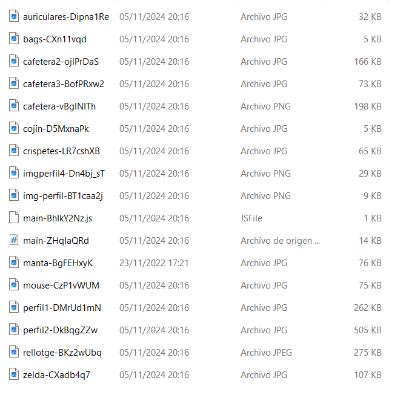
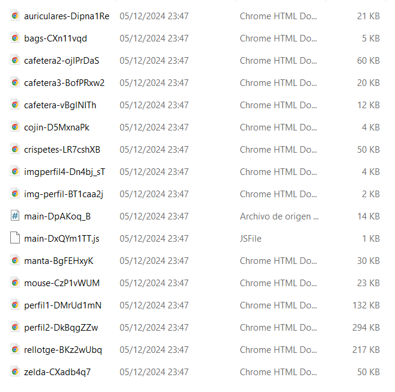
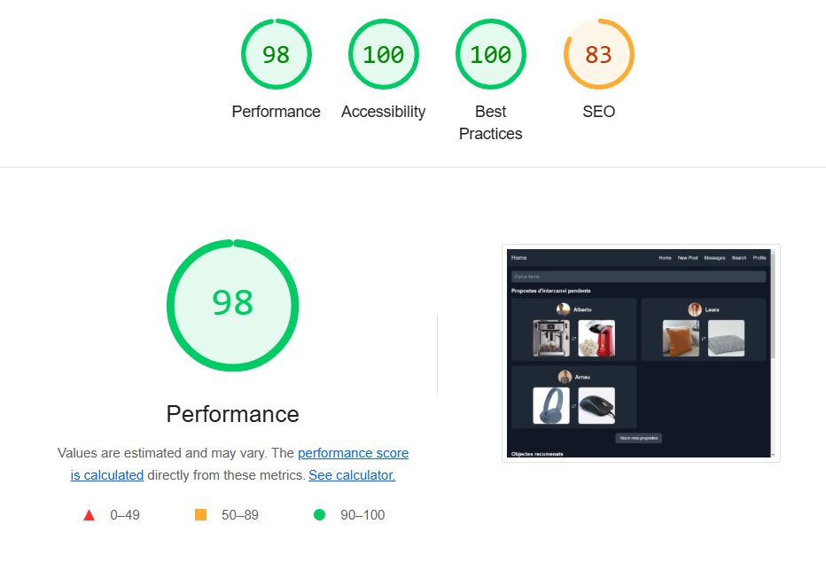
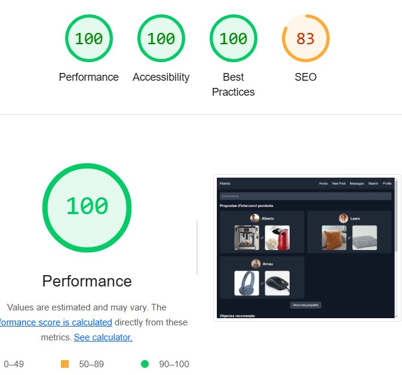

# ProjecteImatgesWebp

### **Fase 3: Revisió del projecte amb Vite**

He fet servir el plugin de vite-plugin-webp-and-path que et converteix totes les imatges al format que vulguis, en aquest cas a WebP, també canvia totes les rutes dels HTML automàticament i li pots dir la qualitat que vols a les imatges, jo he posat al 80%

**vite.config.js**

```javascript
import { defineConfig } from "vite";
import path from "path";
import VitePluginWebpAndPath from "vite-plugin-webp-and-path";

export default defineConfig({
  plugins: [
    VitePluginWebpAndPath({
      quality: 80,
      imgExtensions: "jpeg,png,jpg",
    }),
  ],
  root: "./",
  base: "./",
  build: {
    outDir: "dist",
    rollupOptions: {
      input: {
        main: path.resolve(__dirname, "index.html"),
        confirmar_proposta: path.resolve(
          __dirname,
          "src/pages/confirmar_proposta.html"
        ),
        detalls: path.resolve(__dirname, "src/pages/detalls.html"),
        home: path.resolve(__dirname, "src/pages/home.html"),
        mostrar_objectes: path.resolve(
          __dirname,
          "src/pages/mostrar_objectes.html"
        ),
        new_object: path.resolve(__dirname, "src/pages/new_object.html"),
        perfil: path.resolve(__dirname, "src/pages/perfil.html"),
        proposta_detalls: path.resolve(
          __dirname,
          "src/pages/proposta_detalls.html"
        ),
        register: path.resolve(__dirname, "src/pages/register.html"),
        serch: path.resolve(__dirname, "src/pages/serch.html"),
        xat: path.resolve(__dirname, "src/pages/xat.html"),
      },
    },
  },
  server: {
    watch: {
      usePolling: true,
    },
  },
});
```

Imatges originals



Imatges optimitzades WebP



## **Lighthouse**

(t'he posat els HTML amb les dades)

Lighthouse sense optimitzar: projecteSenseOptimitzar.html



Lighthouse amb imatges optimitzades: lighthouseOptimitzat.html


